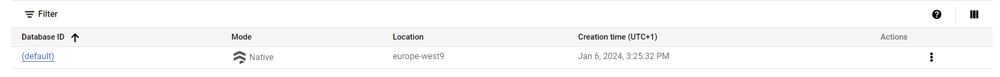

# FastAPI Iris Classification API

This repository contains the source code for building a FastAPI-based API for working with the Iris flower dataset.

## Installing Libraries

```bash
pip install -r requirements.txt
```

### First launching
We run our main.py


It's normal because we have put nothing in the root  endpoint.

We will redirect the root endpoint of your API to the automatic swagger documentation by adding this line in our script

```python
responses.RedirectResponse(url='/docs')
```
And now we're redirected to the swagger


### First call to the API

Now we will make the first call to our API.
We wlll request on the hello route using the swagger directly

Our request will take "Frank" as parameter


Et voilà le travail !! 😄

## Our dataset
The Iris dataset is a famous dataset in the field of machine learning and statistics. It is often used as a beginner's dataset for practicing classification algorithms.

### Downloading 
We create a a route in api/routes/data to download and save the contents of our dataset in the src/data folder


### Loading
We add an endpoint */load-iris* to load the iris dataset file as a dataframe and return it as a json.


### Processing
After download and load the dataset, here comes the step of processing 
in this step , the only thing we are going to do is

- Remove the column *species*
- Standardize the numerical features

Dataset before 


Dataset after


### Split dataset
Then we want split our dataset into two parts , one for training and one for test (which will represents 20% of the data)

The dataset


The dataset splitted


### Training
We train the training set


### Prediction
Now it's time for the prediction


## Firestore
Here come the interisting part :!!!


### Creation of  the Firestore collection
Let's create our firestore dabase on GCP 



Then we create our collection called *parameters* , inside we create a document with the same name with two fields
- n_estimators
- criterion


### Retrieve parameters from Firestore

We can get this parameters through the */get-parameters*


### Update and add Firestore parameters

#### Update


We can get the paramters freshly updated 


#### Add